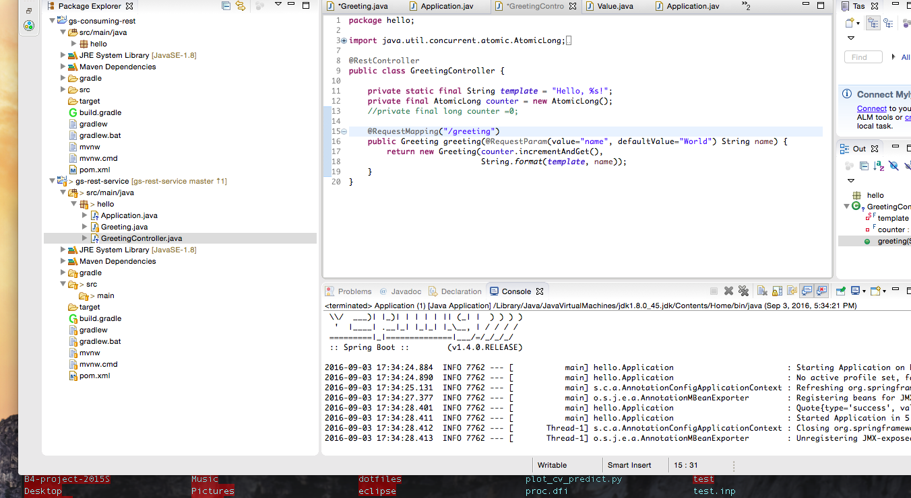

#Note of the developer tools.

##What is Java?
since 1995~ 
一度javaファイルをコンパイルすると、jarファイルが生成されてどのマシンでも使えるようになる。
ビルドツールを使ってjavaファイルからバイナリjarに変換
 
	ex.;Maven , Ant, Gradle,
##What is Maven?
Maven=po.xmlにそのプロジェクトの情報を書く。実際にはxmlファイルを直接触らず、適当なUIから編集. 
"pom.xmlを編集"="Mavenを編集"

##What is SpringFramework?
DI(Dependency Injection)コンテナ, AOP()コンテナを中心とした、Java用のフレームワーク 
特徴としては、フルスタックのFrameworkではなく、複数のコンポーネントからなる集合

- Mavenの意味、Buildしてくれるものだと思っていい。
- Mavenで編集できることは、コンパイル時のjavaのバージョンとか、どのようなライプラリを参照するか、どのようなプラグインを使用するかとかが分かる。
- その書き換えは,pom.xmlをいじる,実際にpom.xmlを触ることはしないで,適当なUIを編集することで、po.xmlが編集される.
- anotation直後のところにくると、その下の関数が実行される
- Mavenがない場合だと、複数のjavaファイルからバイナリが作られて、一つのjarを作る。これをMavenが頑張って作ってくれる

##What is DI?
Dependency Injectionの略 
DIコンテナがない場合
	- インスタンス(class)の生成, インスタンスの利用が同じアプリケーション
 
DIコンテナを利用すると
	- 直接インスタンスを生成していたアプリケーションがDIコンテナを経由してインスタンスの取得が可能になる。
 
だから、、、、従来は、後から変更が難しいアプリケーションの依存性(Class内で、定義されている属性があらかじめ決まってしまっているの)を、変更しやすようにしたもの
 
SpringでサポートされているInjectionの種類は以下の３種 
	- Setter Injection:setter(JavaオブジェクトでFieldが定義されているとして、値を設定するもの)にたいして、セッター引数に対して依存性を後から注入できる。 
	- Constrater Injection:コンストラクタに依存するコンポーネントを後から注入できる 
	- Field Injection:＊＊＊＊＊＊＊＊＊＊＊＊＊＊＊ 

##What is AOP?

##What is REST API?
Web APIの一種、 
#### ``REST=休養``  
ではない
 
#### ``REST=REpresentational State Transfer``
 
クライアントとサーバーの間でのデータのやりとりをするアプリケーションを開発するためのArcitectureの一つ。
データのみを応答するWebアプリケーション。

###What Could I learn?

